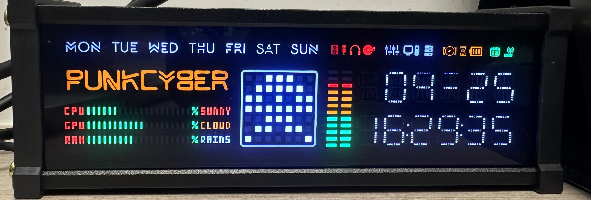

# WFD Pro Clock Controller

A reverse-engineered Python controller and web UI for the **WFD Pro PUNKCYBER** 7×7 LED matrix clock with system monitoring, animation editor, and more.

<p align="center">
  
</p>


[](https://github.com/vinex22/punkcyber-wfdpro/releases/latest)

> **💾 Just want to try it?** Download the [**Windows standalone exe**](https://github.com/vinex22/punkcyber-wfdpro/releases/latest) — no Python needed. Extract, run `WFDProClock.exe`, and open http://localhost:5000.

> **⚠️ Compatibility Notice:** This software is designed and tested **only** for the **WFD Pro PUNKCYBER** clock model (CH340/CH341 USB serial, 7×7 LED matrix). It will **not** work with other WFD models, generic LED clocks, or similar-looking devices. Using it with incompatible hardware may produce unexpected results or damage settings. If your clock model is different, use at your own risk.

## Features

- **Web UI** — Browser-based control panel at `http://localhost:5000`
- **System Monitor** — Send real-time CPU/Memory/GPU usage to the clock's bar display
- **Animation Library** — 20+ built-in animations (rain, plasma, pong, goomba, space invader, etc.)
- **LED Matrix Editor** — Click-to-draw 7×7 pixel patterns and send to clock
- **Animation Upload** — Upload custom `.json` animation files
- **Full Clock Control** — Brightness, sensitivity, display mode, 12h/24h, night mode, time sync
- **CLI Interface** — Command-line control via `wfd_clock.py`
- **Factory Reset** — Restore clock to defaults if something goes wrong

## Hardware

- **Display:** 7×7 LED matrix + CPU/GPU/RAM progress bars + VU meter + date/time
- **Connection:** USB serial via CH340/CH341 chip
- **Baud Rate:** 115200
- **Driver:** [CH341SER](http://www.wch-ic.com/downloads/CH341SER_EXE.html) (Windows) — usually auto-installed

## Quick Start

### 1. Install dependencies

```bash
pip install -r requirements.txt
```

### 2. Run the Web UI

```bash
python wfd_web.py
```

Open **http://localhost:5000** in your browser. Select your COM port, click **Connect**, and you're in.

### 3. Or use the CLI

```bash
python wfd_clock.py
```

## Web UI Controls

| Section | What it does |
|---------|-------------|
| **Connection** | Select serial port, connect/disconnect |
| **Quick Actions** | Sync time, read params, preset patterns (heart, full, clear) |
| **Animation Library** | Click any animation to send it to the clock |
| **Upload** | Upload custom `.json` animation files |
| **Brightness** | LED brightness (1–4) |
| **Sensitivity** | Mic/VU meter sensitivity (1–5) |
| **Display Mode** | Animation transition style (4 modes) |
| **Hour Format** | 12h / 24h toggle |
| **Night Mode** | Set auto-dim time range |
| **System Monitor** | Send CPU/MEM/GPU to the clock's bar display |
| **LED Matrix Editor** | Draw patterns, adjust frame duration, send to clock |

## System Monitor

The clock has dedicated progress bars for CPU, GPU, and RAM. The web UI reads system stats and sends them via command `0x04`:

```
[0xAA, 0x04, CPU%, MEM%, GPU%]
```

- **CPU/MEM:** via `psutil`
- **GPU:** via Windows performance counters (works with Intel/AMD/NVIDIA)
- Stats must be sent every 2–3 seconds to keep bars stable
- Click **Start** to begin auto-sending, **Stop** to pause

## Serial Protocol

All commands start with header byte `0xAA` (170), followed by a command byte.

| Cmd | Hex | Payload | Description |
|-----|-----|---------|-------------|
| 1 | `0x01` | `<total> <index> <7 row bytes> <time_slot>` | Send animation frame |
| 2 | `0x02` | `<level 1-5>` | Set VU meter sensitivity |
| 3 | `0x03` | `<mode 1-4>` | Set display transition mode |
| 4 | `0x04` | `<cpu%> <mem%> <gpu%>` | Send system stats to bar display |
| 5 | `0x05` | `<year-2000> <month> <day> <hour> <min> <sec>` | Sync clock time |
| 6 | `0x06` | `<start_h> <start_m> <end_h> <end_m>` | Set night mode (all zeros = disabled) |
| 7 | `0x07` | `<level 1-4>` | Set LED brightness |
| 8 | `0x08` | `<0 or 1>` | Hour mode (0=24h, 1=12h) |
| 9 | `0x09` | *(none)* | Request current device settings |

### Connection Handshake

1. Open serial port at 115200 baud
2. Set DTR=False, RTS=False, wait 100ms
3. Set DTR=True, RTS=True
4. Wait for device to send `初始化完成` ("initialization complete")
5. Send `[0xAA, 0x09]` to request current parameters

### Row Encoding (Frame Data)

Each row of the 7×7 matrix is encoded as a single byte:
- Bit 6 = column 0 (leftmost) → Bit 0 = column 6 (rightmost)

Example: `[0, 0, 1, 0, 1, 0, 0]` → `0b0010100` = `0x14`

## Animation JSON Format

Animations are JSON arrays of frame objects:

```json
[
  {
    "data": [
      [0, 0, 1, 0, 1, 0, 0],
      [0, 1, 1, 1, 1, 1, 0],
      [1, 1, 1, 1, 1, 1, 1],
      [1, 1, 1, 1, 1, 1, 1],
      [0, 1, 1, 1, 1, 1, 0],
      [0, 0, 1, 1, 1, 0, 0],
      [0, 0, 0, 1, 0, 0, 0]
    ],
    "time_slot": 5
  }
]
```

- `data`: 7×7 array, 0=off, 1=on
- `time_slot`: display duration (1–20, roughly 100ms units)

## Built-in Animations

| Animation | Frames | Description |
|-----------|--------|-------------|
| heartbeat | 12 | Realistic double-beat pulse |
| goomba | 13 | Mario Goomba walking + stomped |
| invader | 16 | Space Invader walk cycle |
| firework | 10 | Rocket rises and explodes |
| snake | 43 | Snake slithering around border |
| pacman | 8 | Pac-Man chomping |
| rain | 30 | Matrix-style rain |
| wave | 14 | Sine wave scrolling |
| spiral | 98 | Pixel spirals in and out |
| spinner | 16 | Loading spinner |
| dna | 14 | Double helix rotating |
| bounce | 30 | Ball bouncing off walls |
| tetris | 9 | T-piece drop + line clear |
| plasma | 60 | Lava lamp sine wave effect |
| starfield | 60 | 3D starfield flying through space |
| matrix_rain | 60 | Dense cyberpunk rain streams |
| gameoflife | 80 | Conway's Game of Life |
| morph | 65 | Shape morphing transitions |
| running_man | 60 | Stick figure running |
| maze | 28 | Maze carved in real-time |
| pong | 120 | Pong game with AI + scoring |
| particles | 100 | Particle explosions with gravity |
| countdown | 100 | Cinematic 10→0 countdown |
| vinay | 25 | Custom name animation |

> **Note:** The clock may crash with animations over ~99 frames. Keep frame count reasonable.

## Generate Animations

```bash
python gen_animations.py    # 13 basic animations
python gen_animations2.py   # 10 complex animations
```

## Factory Reset

If the VU meter or other features stop working:

```bash
python reset_clock.py
```

Then unplug USB, wait 3 seconds, and replug.

## Build Standalone .exe

```bash
pip install pyinstaller
pyinstaller --name WFDProClock --onedir --noconfirm \
  --add-data "matrix;matrix" --add-data "wfd_clock.py;." \
  --hidden-import psutil --hidden-import serial \
  --collect-submodules serial wfd_web.py
```

Output: `dist/WFDProClock/WFDProClock.exe`

## Project Structure

```
wfdpro/
├── wfd_clock.py          # Core library + CLI controller
├── wfd_web.py            # Flask web UI
├── reset_clock.py        # Factory reset script
├── gen_animations.py     # Basic animation generator
├── gen_animations2.py    # Complex animation generator
├── requirements.txt      # Python dependencies
├── matrix/               # Animation JSON files
│   ├── goomba.json
│   ├── heartbeat.json
│   ├── invader.json
│   ├── plasma.json
│   └── ... (20+ animations)
└── WIKI.md               # Detailed protocol documentation
```

## How It Was Made

The serial protocol was reverse-engineered from the original Chinese configuration software (`WFDPro配置软件.exe`) using:
- [pyinstxtractor-ng](https://github.com/pyinstxtractor/pyinstxtractor-ng) to extract the PyInstaller bundle
- Python `dis` module to disassemble bytecode
- Manual protocol testing via serial

## Important Notes

- **VU Meter:** The built-in audio VU meter only works when no serial connection is active. Disconnect after configuring settings to restore it.
- **Safe Commands:** Only use commands `0x01`–`0x09`. Sending unknown command bytes (0x0A+) can corrupt clock settings and disable the VU meter. Use `reset_clock.py` to fix.
- **System Stats Bars:** Require continuous sending every 2–3 seconds to stay stable. They drift to random values if not refreshed.

## License

MIT

## Author

Created by **Vinay Jain** — [vinex22@gmail.com](mailto:vinex22@gmail.com) | [vinayjain@microsoft.com](mailto:vinayjain@microsoft.com)

---

**Disclaimer:** This project is not affiliated with or endorsed by the manufacturer of the WFD Pro clock. The serial protocol was reverse-engineered for personal/educational use. Use at your own risk.

---

# WFD Pro 时钟控制器（中文版）

逆向工程的 Python 控制器和 Web 界面，适用于 **WFD Pro PUNKCYBER** 7×7 LED 点阵时钟，支持系统监控、动画编辑器等功能。

<p align="center">
  
</p>

> **⚠️ 兼容性提示：** 本软件仅适用于 **WFD Pro PUNKCYBER** 时钟型号（CH340/CH341 USB 串口，7×7 LED 点阵）。不适用于其他 WFD 型号、通用 LED 时钟或外观相似的设备。使用不兼容的硬件可能会产生意外结果或损坏设置。如果您的时钟型号不同，请自行承担风险。

> **💾 想直接试用？** 下载 [**Windows 独立可执行文件**](https://github.com/vinex22/punkcyber-wfdpro/releases/latest) — 无需安装 Python。解压后运行 `WFDProClock.exe`，打开 http://localhost:5000 即可使用。

## 功能特性

- **Web 界面** — 浏览器控制面板 `http://localhost:5000`
- **系统监控** — 实时发送 CPU/内存/GPU 使用率到时钟的进度条显示
- **动画库** — 20+ 内置动画（雨滴、等离子、乒乓、酷霸、太空入侵者等）
- **LED 点阵编辑器** — 点击绘制 7×7 像素图案并发送到时钟
- **动画上传** — 上传自定义 `.json` 动画文件
- **完整时钟控制** — 亮度、灵敏度、显示模式、12h/24h、夜间模式、时间同步
- **命令行界面** — 通过 `wfd_clock.py` 进行命令行控制
- **恢复出厂设置** — 出现问题时恢复时钟默认设置

## 快速开始

### 1. 安装依赖

```bash
pip install -r requirements.txt
```

### 2. 运行 Web 界面

```bash
python wfd_web.py
```

在浏览器中打开 **http://localhost:5000**，选择串口，点击 **Connect** 即可。

### 3. 或使用命令行

```bash
python wfd_clock.py
```

## 串口协议

所有命令以头字节 `0xAA`（170）开始，后跟命令字节。

| 命令 | 十六进制 | 载荷 | 说明 |
|------|----------|------|------|
| 1 | `0x01` | `<总帧数> <帧序号> <7个行字节> <时间槽>` | 发送动画帧 |
| 2 | `0x02` | `<等级 1-5>` | 设置 VU 表灵敏度 |
| 3 | `0x03` | `<模式 1-4>` | 设置显示过渡模式 |
| 4 | `0x04` | `<cpu%> <mem%> <gpu%>` | 发送系统状态到进度条 |
| 5 | `0x05` | `<年-2000> <月> <日> <时> <分> <秒>` | 同步时钟时间 |
| 6 | `0x06` | `<开始时> <开始分> <结束时> <结束分>` | 设置夜间模式（全零=禁用） |
| 7 | `0x07` | `<等级 1-4>` | 设置 LED 亮度 |
| 8 | `0x08` | `<0 或 1>` | 小时模式（0=24h，1=12h） |
| 9 | `0x09` | *（无）* | 请求当前设备设置 |

## 恢复出厂设置

如果 VU 表或其他功能停止工作：

```bash
python reset_clock.py
```

然后拔掉 USB，等待 3 秒，重新插入。

## 构建独立 .exe

```bash
pip install pyinstaller
pyinstaller --name WFDProClock --onedir --noconfirm \
  --add-data "matrix;matrix" --add-data "wfd_clock.py;." \
  --hidden-import psutil --hidden-import serial \
  --collect-submodules serial wfd_web.py
```

输出：`dist/WFDProClock/WFDProClock.exe`

## 重要提示

- **VU 表：** 内置音频 VU 表仅在没有串口连接时工作。配置设置后断开连接即可恢复。
- **安全命令：** 仅使用命令 `0x01`–`0x09`。发送未知命令字节（0x0A+）可能损坏时钟设置并禁用 VU 表。使用 `reset_clock.py` 修复。
- **系统状态条：** 需要每 2-3 秒持续发送以保持稳定。如果不刷新，数值会漂移。

## 作者

由 **Vinay Jain** 创建 — [vinex22@gmail.com](mailto:vinex22@gmail.com) | [vinayjain@microsoft.com](mailto:vinayjain@microsoft.com)

**免责声明：** 本项目与 WFD Pro 时钟制造商无关，也未获其认可。串口协议是为个人/教育目的逆向工程而来。使用风险自负。
